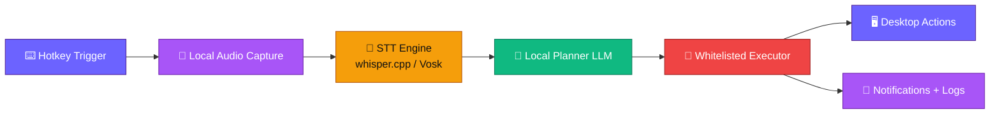

<div align="center">
  
</div>

<div align="center">


</div>

<p align="center"><strong>An offline-first desktop agent that listens on hotkey, plans with a local LLM, and executes safe background actions.</strong></p>

<div align="center">
  🚀 <a href="#-quick-start">Quick Start</a> • 📖 <a href="#-development">Docs</a> • 🔧 <a href="#-configuration">Config</a> • 🤝 <a href="#-contributing">Contributing</a>
</div>

## ✨ Why Desktop Voice Agent?

|   | Feature |
|---|---|
| 🎙️ | **Hotkey Voice Activation** — Trigger listening with a configurable shortcut and capture voice commands quickly. |
| 🧠 | **Local LLM Planner** — Convert transcripts into structured JSON execution plans with confidence gating. |
| 🧰 | **Safe Tool Executor** — Run only whitelisted operations like app launch, command run, file write, browser open, and notifications. |
| 🔔 | **Background UX + Notifications** — Execute tasks asynchronously and notify success/failure without blocking desktop workflow. |
| 🛡️ | **Privacy + Safety by Default** — Keep audio/transcripts local and block dangerous operations unless explicitly elevated. |

## 🏗️ Architecture



## 📦 Prerequisites

| Requirement | Badge | Notes |
|---|---|---|
| Python |  | Backend orchestrator target |
| Node.js |  | Needed for Tauri frontend workflow |
| Rust |  | Required by Tauri builds |
| STT Model Runtime |  | Local transcription |
| Local LLM Runtime |  | Planner inference |

## 🚀 Quick Start

> [!IMPORTANT]
> This repository currently contains the product requirements (`PRD.md`) and implementation roadmap; code scaffold is planned next.

### 1️⃣ Clone repository
```bash
git clone https://github.com/IqbalHere/Desktop-Voice-Agent.git
cd Desktop-Voice-Agent
```

### 2️⃣ Review current scope
```bash
cat PRD.md
```

### 3️⃣ Start implementation from roadmap
```bash
# Begin with roadmap item #1 in PRD:
# "Create repository scaffold: Tauri tray + hotkey + Python IPC"
```

<details>
<summary>macOS/Linux notes</summary>

```bash
# Use your package manager to install python3, node, and rust toolchain
```

</details>

<details>
<summary>Windows notes</summary>

```powershell
# Install Python 3.11+, Node.js LTS, and Rust (rustup) before scaffolding
```

</details>

## 🔧 Configuration

| Variable | Required | Description |
|---|---|---|
| `HOTKEY` | ✅ | Keyboard shortcut that toggles microphone listening (example: `Ctrl+Space`). |
| `AUTO_CONFIRM_THRESHOLD` | ✅ | Confidence threshold for auto-run (recommended `> 0.85`). |
| `DEVELOPER_MODE` | ❌ | Enables elevated/risky operations for development use only. |
| `LOCAL_STT_MODEL` | ✅ | Path/model selection for local STT runtime (whisper.cpp or Vosk). |
| `LOCAL_LLM_MODEL` | ✅ | Local planner model selection (GGUF/Ollama-served model). |
| `LOG_RETENTION_DAYS` | ❌ | Log persistence duration before purge. |

> [!NOTE]
> Per PRD, all audio, transcript, and planning context should remain local by default, with explicit controls for purge and elevated execution.

## 📚 API / Tool Reference

### Planner output contract

| Parameter | Type | Required | Default | Description |
|---|---|---|---|---|
| `plan` | `array<object>` | ✅ | `[]` | Ordered executable steps returned by planner. |
| `plan[].id` | `string` | ✅ | — | Step identifier (e.g., `s1`). |
| `plan[].type` | `string` | ✅ | — | Whitelisted tool type (`open_app`, `run_cmd`, etc.). |
| `plan[].args` | `object` | ✅ | `{}` | Tool arguments. |
| `plan[].explain` | `string` | ✅ | — | Human-readable step explanation. |
| `auto_confirm` | `boolean` | ✅ | `false` | Whether execution can run automatically. |
| `confidence` | `number` | ✅ | `0.0` | Planner confidence score. |

```json
{
  "plan": [
    {
      "id": "s1",
      "type": "open_app",
      "args": { "name": "chrome" },
      "explain": "Open Chrome"
    }
  ],
  "auto_confirm": true,
  "confidence": 0.91
}
```

## 🛡️ Error Handling

| Scenario | Behavior |
|---|---|
| 🚫 Non-whitelisted tool step | Reject step and notify user that action is blocked. |
| ❌ Dangerous command pattern detected | Prevent execution unless explicit elevated mode policy allows it. |
| 🔁 Step execution failure | Mark step `failed`, continue/stop by policy, and record logs with reason. |
| ↩️ Undo requested for reversible step | Attempt rollback (e.g., delete created file) or explain why rollback is unavailable. |

## 🧰 Development

### Dev workflow commands
```bash
# Current repo state: PRD-only (no runnable code scaffold yet)
cat PRD.md
```

### Project structure
```text
📦 Desktop-Voice-Agent
├── 📄 README.md
└── 📄 PRD.md
```

## 🛠️ Tech Stack

<div align="center">

| Layer | Technology | Role |
|---|---|---|
| Desktop UI |  | Tray, global hotkey, overlay UI |
| Orchestrator |  | Command orchestration and execution flow |
| Speech-to-Text |  | Local transcription |
| Planner LLM |  | Local reasoning and plan generation |
| Automation |  | Browser automation in executor tools |
| Memory |  | Local logs and future memory storage |

</div>

## 🤝 Contributing

1. Fork this repository
2. Create a branch (`git checkout -b feature/your-change`)
3. Commit your changes (`git commit -m "feat: describe change"`)
4. Push your branch (`git push origin feature/your-change`)
5. Open a Pull Request

## 📄 License

License is currently **TBD**. Add a [`LICENSE`](./LICENSE) file to define distribution terms.

<div align="center">
  
  <p><strong>Built with ❤️ by <a href="https://github.com/IqbalHere">Iqbal</a></strong></p>
  <p>
    
    
    
  </p>
  <p>⭐ Star this repo if you found it useful! ⭐</p>
</div>
